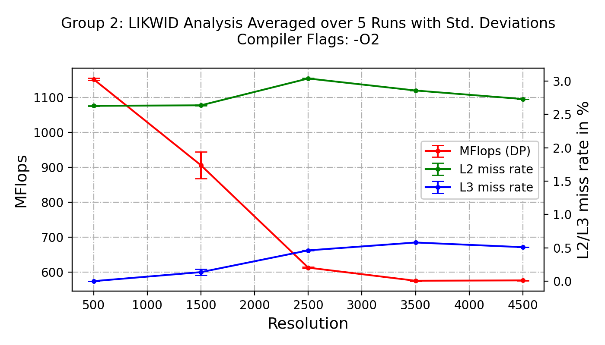
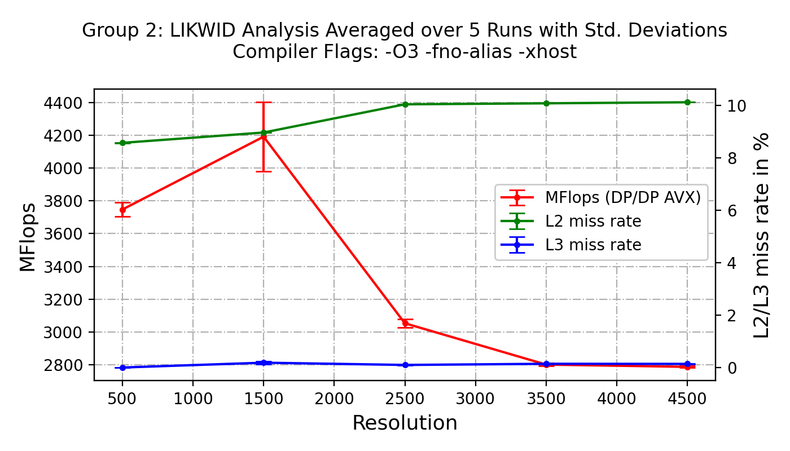

## Assignment 2

Analyze the performance of the application with respect to the memory and cache usage. Perform all final measurements for the original code with O2 and the best flag combination (-O3 -fno-alias -xhost) for test.dat in a batch job! Groups with odd numbers should use PAPI and Groups with even numbers should use Likwid.

**Vtune overhead**: CPU elapsed time 8.079, vtune 8.139

- ***2.1 Provide a single diagram with the MFlop rate and the L2 and L3 missrates in percent of cache accesses for the application compiled with -O2 and -O3 -fno-alias -xhost combination. Present a table with the number of L2 and L3 cache misses in thousands for the different problem sizes.***

- ***2.2 Measure the MFlop rate with the hardware counters and compare the result with the number computed in the program.***
very similar when measured correctly (without measuring the likwid runtime)

- ***2.3 Determine the processor's clock frequency with the help of the performance counters.***
Likwid:  GHz
Vtune: 2.3 GHz
Nominal: 2.7 GHz

- ***2.4 Confirm, whether vectorization was used or not for the two differently compiled versions, with the help of the performance counters.***
Likwid has two measurement groups for measuring flop count: DP and DP AVX. DP AVX counts double precision flops of AVX instructions (i.e. vectorized code). For the compiler flag -O2, DP AVX is 0, showing that no vectorization happened. For -O3, DP AVX and DP are roughly the same, meaning that the code was vectorized.

- ***2.5 After you measurements with PAPI or Likwid, investigate the performance of both versions with the help of vtune. Determine the overhead of running vtune data collector. Submit images of all four analysis types for 3200 resolution and 200 iterations and mark interesting aspects that you want to explain in the meeting.***
Interesting remarks:

**PerformanceSnapshot:**

- 1% core utilisation (bc were using 1 core out of 96)
- low IPC: check architecture
- 25% of pipeline slots: stalling
- full fill buffer: CPU cant keep up with the instructions

**MemoryAccess:**

- why is it using UPI and the DRAM from the socket where no cores are being used?
- latency histogram: some loads are very high latency
- bandwidth: much lower than max
- 70% is memory bound, of whih 45% is DRAM
- memcpy is the most CPU time function

**MicroArchitecture:**

- backend bound (execution, memory access)
- vectorization only at 50% of vector capacity (due to no ZMM?)

**Hotspots:**

- most active function is memcpy, residual and relaxed

### Deliverables
- Submit the two graphs and be able to discuss all the parts of the assignments. Submit one screenshot of each vtune analysis of the best version for 3200 resolution and 200 iterations and mark what you found interesting. 

- Submit all graphs in png format as separate files. best.png, O2.png, snapshot.png, memoryaccess.png, microarchitecture.png, hotspots.png. Always have your group mentioned on the figure. 
