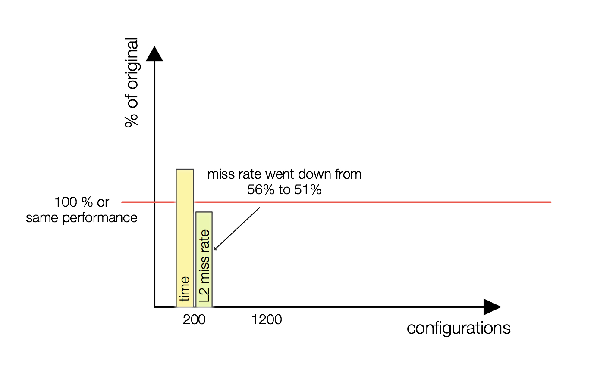

## Sequential Optimization of Jacobi

**3.1** In this assignment, you should come up with changes of heat that improve sequential performance. For this, check the following points for ways to improve the code:

- access pattern into the matrix
- calculation of residuum
- avoid copy operation

Compare the final optimized version with the original version (-O3 -xhost -fno-alias) with the following diagram. Definitely include the comparison with respect to the execution time. Compare all relevant metrics.

- Check the benefit of changes with the PAPI/Likwid measurements. 

**Is the NUMBER of floating point operations effected by your transformations.** No

**3.2 There is a performance issue around sizes of powers of 2, e.g. np=1020, 1022, 1024, 1026. Can you explain it? How to get rid of that issue?** The L2 cache is 4-way set associative (number of sets = cache lenght/(4*byte per line)), this means that array elements with distance equal to a power of 2 might be placed in the same set, this causes cache conflict (A sequence of accesses to memory repeatedly overwriting the same cache entry). It so happens that these array elements are the ones we need during jacobi relxation 

**3.3 Submit images of all four analysis types in Vtune for the manually tuned version for 3200 resolution and 200 iterations and mark aspects that changed in the manually tuned compared to the best compiler flag version.**

### Deliverables
Submit the diagram with the comparison as PNG. Submit also the vtune graphs group<N>_snapshot.png, ...memoryaccess.png, ...microarchitecture.png, ...hotspots.png. Always have your group mentioned on the diagram.