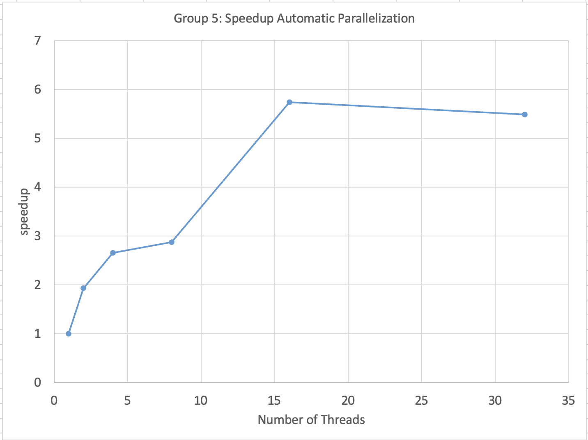
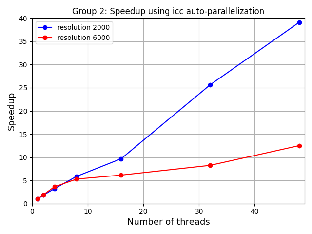

## OpenMP

For all further assignments, please use the provided optimized code taken from ASSIGNMENT 4.1 (see above).

### ASSIGNMENT 4.2
The Intel compiler supports automatic parallelization. It is switched on with the "-parallel" option. The compiler tries to parallelize simple loops. Please read the compiler documentation available.

**TASK 4.2.1**: Try the automatic parallelization feature of icc. The compiler might parallelize all the loops. With the "-opt-report-phase=par" option you will receive a report explaining the reasons why parallelization was not possible. Improve the parallelization by rewriting the code and inserting pragmas (no OpenMP pragmas). Be able to explain why it worked or did not work in a short report.
* Without rewriting code: optimization report tells us that loops are not optimized due to "insufficient computational work"
* Force parallelization with compiler flag [-par-threshold0](https://www.intel.com/content/www/us/en/docs/cpp-compiler/developer-guide-reference/2021-8/par-threshold-qpar-threshold.html) (takes value between 0 and 100)
* Specify number of threads with -par-num-threads=n

**TASK 4.2.2**: Do performance measurements for 1, 2, 4, 8, 12, 16, 24, 32 and 48 threads on SuperMUC with the configuration in test.dat. Provide a speedup graph for the given configurations. In a speedup graph the x-axis is the number of threads and the y-axis the achieved speedup. Use the reported execution time for the given sequential code as the basis for the speedup calculation. Use a linear scale for x- and y-axis.

**TASK 4.2.3**: Is there a difference between the sequential time from Assignment 4.1 and the sequential time of automatically parallelized version?
* Parallelized version with 1 thread is slightly slower than sequential version due to parallel overhead

#### Deliverable
Provide a speedup graph for the given configurations where the x-axis is the number of threads and the y-axis the achieved speedup. Use the reported execution time for the sequential code (Assignment 4.1) as the basis for the speedup calculation. (File name: GroupN_ASS4.2.png)

### ASSIGNMENT 4.3
For all further assignments, please use the provided optimized code taken from ASSIGNMENT 4.1 (see above).

Manual parallelization with OpenMP

**TASK 4.3.1**: Parallelize the Jacobi algorithm with OpenMP.
Run the given problem sizes with 1, 2, 4, 8, 12, 16, 24, 32 and 48 threads. 

**TASK 4.3.2**: Optimize for NUMA according to first touch allocation policy. Any other optimization possibilities? Rerun with optimized code and compare to the results above.

**TASK 4.3.3**: Idenitify how to adjust the thread to core mappings and provide absolute performance and speedup comparisons between multiple assignments (at least spread and compact). Use the KMP_AFFINITY environment variable. (https://www.intel.com/content/www/us/en/develop/documentation/oneapi-dpcpp-cpp-compiler-dev-guide-and-reference/top/optimization-and-programming/openmp-support/openmp-library-support/thread-affinity-interface.html)

#### Deliverable

Provide a speedup graph comparing with and without first touch for the two configurations (2000,6000). Without any special Affinity settings.  (filename: GroupN_ASS4.3_speedup.png)
Provide a speedup graph for the configurations (2000, 6000) with two curves for cyclic and block thread distribution with first touch. (filename: GroupN_ASS4.3_first_touch.png)
Run also measurements with vtune for your best OpenMP version with 3200 resolution. Compare the measurements to the vtune results with a single thread. Submit interesting graphs with annotations.(filenames: GroupN_ASS4.3_vtune...png)
Submit all graphs in png format.
